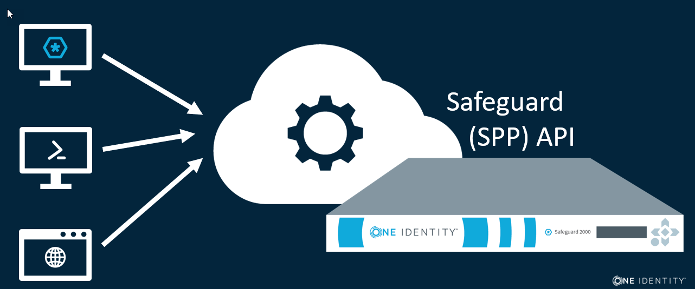

# SPP 1 -- Introduction to the Safeguard API

Safeguard for Privileged Passwords (SPP) is built as a secure, hardened
appliance to provide protection for passwords and private keys. In addition to
storing these credentials, SPP automates the management of the credentials in
the environment, which helps regulatory compliance and security. To access
passwords, private keys, and sessions, SPP provides a role-bashed policy model
and access request workflow. SPP maintains and indelible audit log of all
details of credential access, credential management, and configuration changes.

Because it is a secure, hardened appliance, all of the functionality of SPP is
exposed only through the Safeguard API. There is no direct console access.
There are no backdoors. There no special internal interfaces that only One
Identity can use. All of the functionality that you see in the SPP UI is
presented based on interactions with the Safeguard API.

