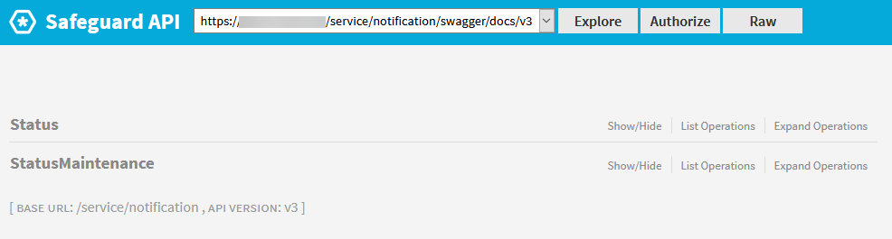
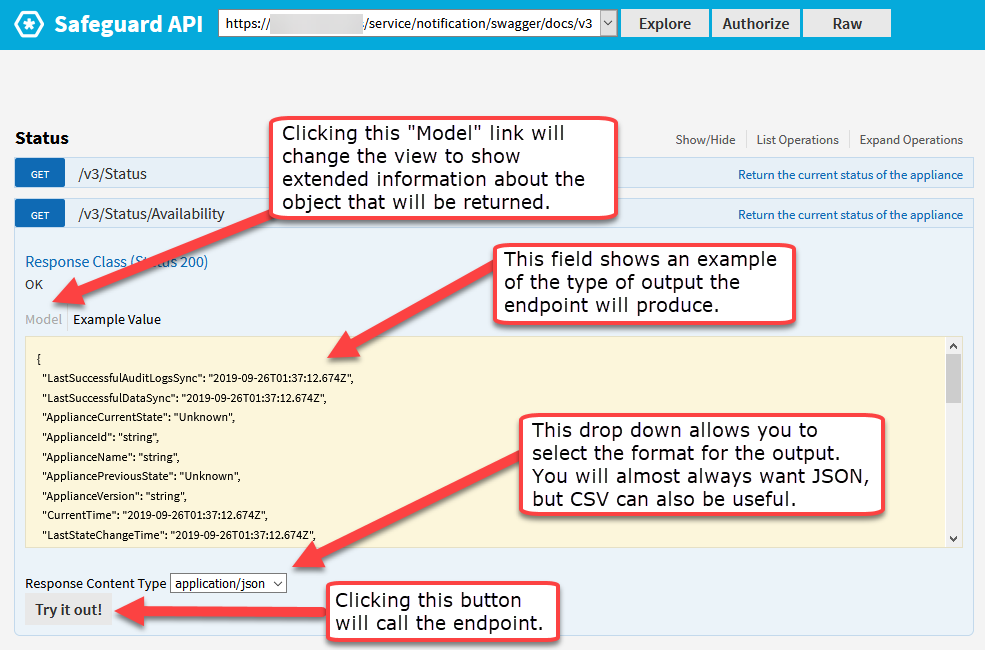
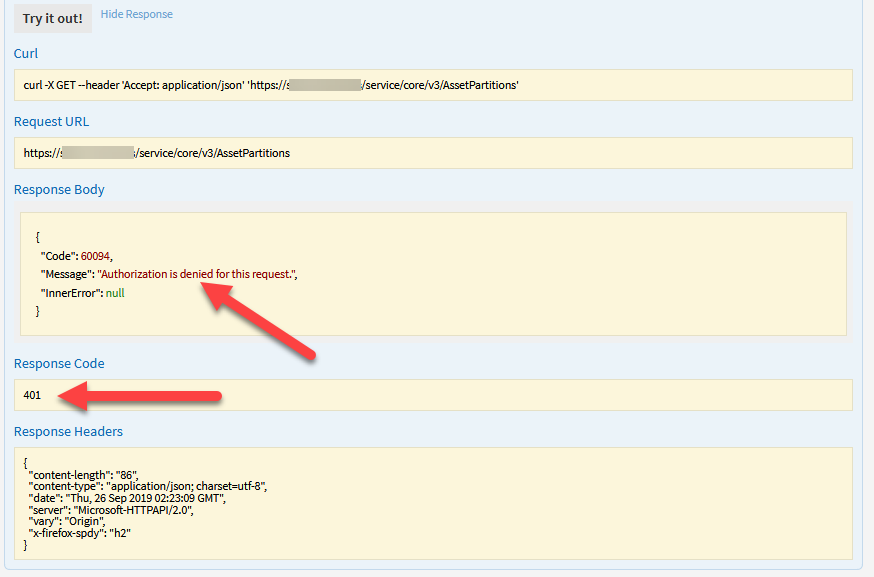
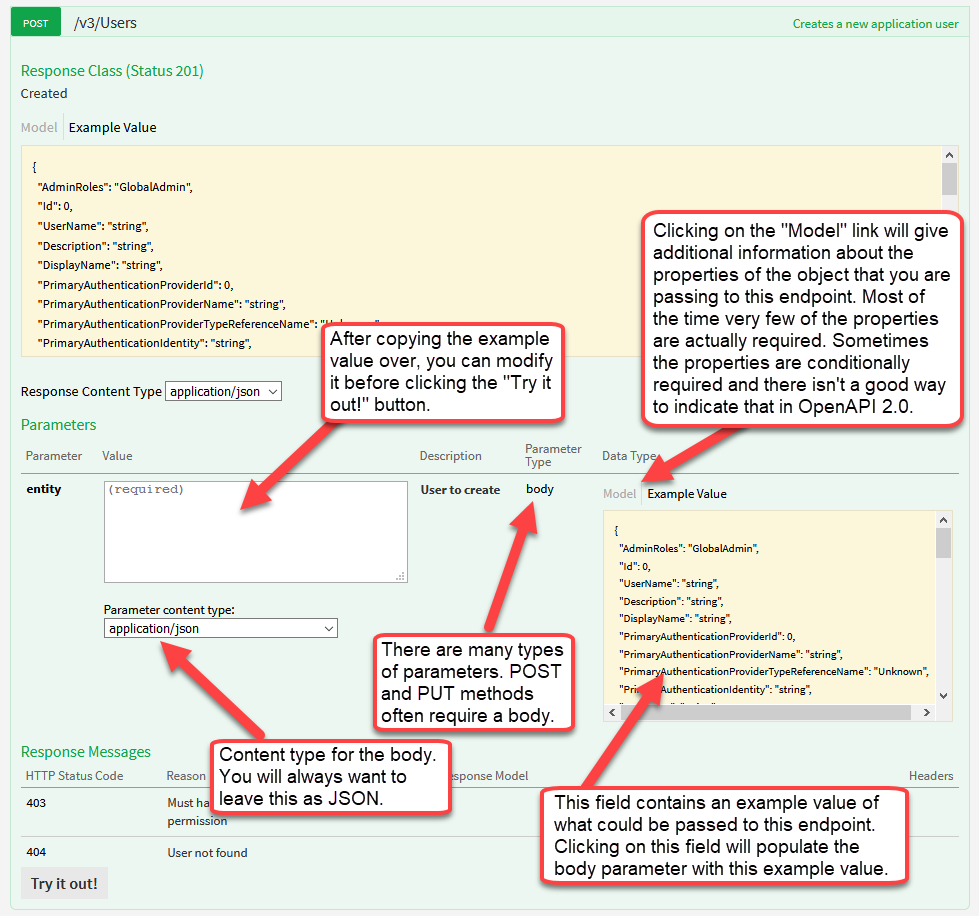
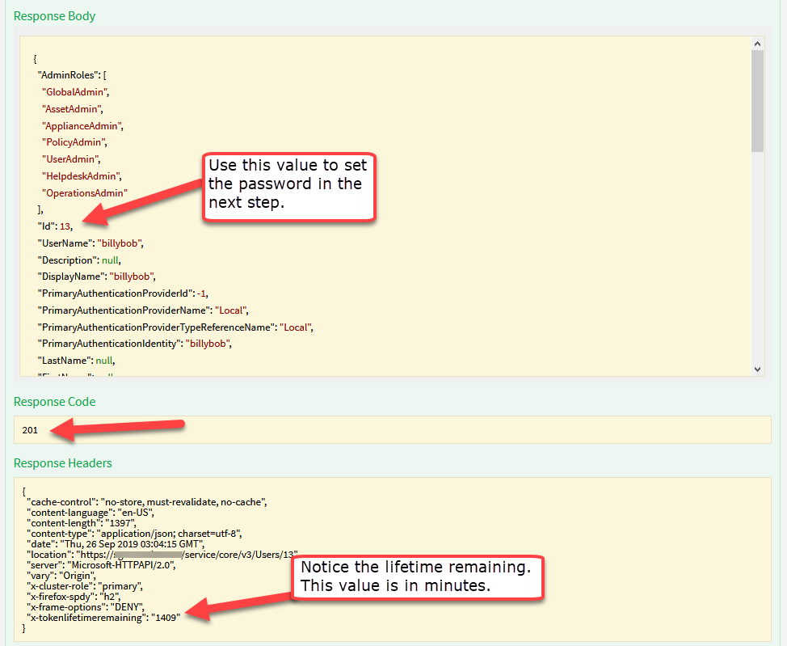

# Swagger UI Hands-on Lab

## 1. Find the Swagger OpenAPI file

To access the Swagger OpenAPI file use a browser to navigate to:

`https://<address>/service/<service>/swagger/docs/v3`

- Replace `<address>` with your appliance network address or DNS name.
- Replace `<service>` with one of `core`, `appliance`, or `notification`.

When you open this URL you will see a very large JSON document. This JSON
document describes the Safeguard API. This JSON document is far too large to
try to understand. Besides it is minified making it nearly impossible to read.

If you opened the URL with Chrome or Firefox, your browser will automatically
parse and format this huge JSON file so you can see the basic structure.


You can see that as of this writing (SPP 2.10) the Safeguard API is using the
Swagger or OpenAPI specification version 2.0.

Expanding the `paths` node in Firefox or another JSON document parser will show
all of the endpoints published for this service in the Safeguard API.

Expanding an individual path will show the HTTP methods that are available for
that path, e.g. `get`, `post`, `put`, `delete`. These methods correspond with
standard data manipulation verbs (CRUD):

  - `post` = `create`
  - `get` = `read`
  - `put` = `update`
  - `delete` = `delete`

The exception to this rule is that the HTTP `post` method is overloaded in
several places in the Safeguard API to perform a `post` action, when that
particular action does not fit neatly into CRUD semantics. In these cases the
path to that endpoint will end in a verb rather than a noun.

For example, `post` `service/core/v3/AccessRequests/{id}/Deny` is a `post`
action, whereas `post` `service/core/v3/AccessRequests` is a `create` action.

Expanding the `definitions` node will show all of the data transfer objects
(DTOs) that are published for this service in the Safeguard API. DTOs are the
data representations that are passed back and forth from REST APIs.

## 2. Find Swagger UI

Let's start by looking at the `notification` service.

To access the Swagger UI use a browser to navigate to:

`https://<address>/service/<service>/swagger`

But, replace `<service>` with `notification`. Your browser will be
automatically redirected to:

`https://<address>/service/<service>/swagger/ui/index`

Sometimes Swagger UI can take a significant amount of time to load, especially
with the `core` service. `notification` should load very quickly. Once the page
loads, you will see a long list of top-level endpoints that are hosted by the
service.



## 3. Calling the notification service -- anonymous GET

Click on `Status` to expand that endpoint to reveal the endpoints that are
available beneath it. Then, click again on `GET /v3/Status/Availability`.
This will expand to reveal an HTML form that allows you to interact with the
selected endpoint.



The top portion of the form contains a field that will show an example of the
type of output the endpoint will produce. There is a link to `Model` which will
switch to a view that gives detailed information about the object properties in
the `Example Value`. The drop down next to `Response Content Type` will allow
you to select a different type of output. Usually, `application/json` is the
most useful output, but for reporting use cases `text/csv` is also very
helpful.

Click on the `Try it out!` button to call the `GET /v3/Status/Availability`
endpoint. Swagger UI will issue an HTTP GET request to the server. The HTML
form will expand to show the resulting output from the HTTP response.


The `Response Body` field will have your output. The `Response Code` will
indicate whether the call was successful. Anything in the 200s is success, but
anything in the 400s or 500s is a failure. Most of the time failures will
include additional information in the `Response Body` field. The
`Response Headers` can be useful for authenticated requests. They will include
a header that tells you how much time is left on your Safeguard API token.

If you look at the information in the `Response Body` you can see that the
SPP appliance is in the "Online" state. This `notification` endpoint is always
available even during maintenance and it doesn't require authentication. The
cURL command listed here could be used from a load balancer to determine
whether or not this SPP appliance is "Online". It can also determine whether
this appliance "IsPrimary".

## 4. Authenticate to Safeguard using Swagger UI

Let's move on to the `core` service where we can actually make changes to SPP
configuration. Change the URL in your browser to:

`https://<address>/service/<service>/swagger`

But, replace `<service>` with `core`. Your browser will be automatically
redirected to:

`https://<address>/service/<service>/swagger/ui/index`

This time it will take a while for the page to load. Swagger UI is processing
a much larger OpenAPI file.

Once the page opens, click on the `AssetPartitions` endpoint. Then, click on
`GET /v3/AssetPartitions` to expand the endpoint.

Click on `Try it out!` as you did before. This time the HTTP response will be
an error because you are not authenticated.



The `Response Code` and `Response Body` clearly indicate the error. Another
error that you might see when calling endpoints on the `core` service is a 403
which means that your user is authenticated but doesn't have the correct rights
in SPP to use the endpoint.

In order to authenticate, scroll back up to the top of the Swagger UI page and
look for the `Authorize` button.


Click on the `Authorize` button and authenticate as the bootstrap admin. You
will go through the normal SPP authentication process.

When you are redirected back to the Swagger UI page go all the way down to the
bottom and find the `Users` endpoint. Let's use it to create a user for use in
this and future tutorials.

## 5. Calling the core service to create a user

Click on `POST /v3/Users` to expand that endpoint. The HTML form will expand
to show more options for calling this endpoint.



There are different types of parameters that can be passed in your HTTP request
using Swagger UI. `POST` and `PUT` endpoints generally require a body for the
HTTP request. This body parameter will often be called `entity`. Other types of
parameters include query and path parameters.

You will need to prepare a body in order to call this endpoint to create your
new user. You can click on the `Example Value` in the `Parameters` section to
copy that value into the body for the `entity` parameter. You can generally
delete most of the properties that get copied over.


Make sure you use the corner of the `Value` field to give yourself enough room
to compose your HTTP request body. If you switch over to `Model` you will see
bolded property names for those that are required. This information is mostly
accurate, but some endpoints have conditional required fields which is
difficult to represent in OpenAPI 2.0.

Compose a body for your new user. The picture above says "string" for the user
name which is a terrible name for a user. Use something similar to the body
below which will give the new user the admin rights necessary to do whatever
future tutorials require.

```JSON
{
  "AdminRoles":[
    "GlobalAdmin",
    "AssetAdmin",
    "ApplianceAdmin",
    "PolicyAdmin",
    "UserAdmin"],
  "UserName": "billybob",
  "PrimaryAuthenticationProviderId": -1
}
```

Click on the `Try it now!` button to send your HTTP request.

The response will include a large JSON body representing the new user you just
created. Take note of the "Id" field, because we will use that in the next
step.



## 6. Calling the core service to set the user password

Click on `PUT /v3/Users/{id}/Password` to expand that endpoint. The HTML form
will expand to show more options for calling this endpoint.

You will notice that there is a new parameter called `id` with the path type.
You can see from the URL of the endpoint how this `id` will be filled into the
HTTP request.

To set a password for your new user, you need to type the "Id" from the
previous step into the `Value` of the `id` parameter. In my case this is 13.

Then, you need to set the password. Notice that the `Parameter content type` is
set to `application/json`. This means that I need to quote the string that I
put into the body.


Set your password to the quoted JSON string you want, then click the
`Try it out!` button.

This time you will get a 204 `Response Code` indicating success, but you will
not get a `Response Body`.

Now you can go back to the `Authorize` button at the top of the Swagger UI and
reauthenticate as your new user.

## 7. Using query parameters

Click on `GET /v3/Users` to expand that endpoint. The HTML form will expand to
show more options for calling this endpoint.

You will notice that there are a lot of new parameters for this endpoint. Most
of them are query parameters and they show up for many of the `GET` endpoints
in the Safeguard API.

The following is a breakdown for using these query parameters:

| Output			| Example															| Notes 								|
| -----				| -----																| ----- 								|
| `fields`			| `GET /Users?fields=FirstName,LastName` 							| 	 									|
| `orderby`			| `GET /AssetAccounts?orderby=-AssetName,Name`						| `-` implies descending				|

| Paging			| Example															| Notes 								|
| -----				| -----																| ----- 								|
| `count`			| `GET /Asset?count=true`				 							| 	 									|
| `page` & `limit`	| `GET /DirectoryAccounts?page=3&limit=100`							| `0` is the first page					|


| `filter`			| Example															| Notes 								|
| -----				| -----																| ----- 								|
| `eq`				| `GET /AssetAccounts?filter=Name eq 'George'`						| equal to 								|
| `ne` 				| `GET /Users?filter=LastName ne 'Bailey'` 							| not equal to 							|
| `gt` 				| `GET /Assets?filter=Id gt 10` 									| greater than 							|
| `ge` 				| `GET /Assets?filter=Id ge 10` 									| greater than or equal to 				|
| `lt` 				| `GET /Assets?filter=Id lt 10` 									| less than 							|
| `le` 				| `GET /Assets?filter=Id le 10` 									| less than or equal to 				|
| `and` 			| `GET /UserGroups?filter=(Id eq 1) and (Name eq 'Angels')` 		| 										|
| `or` 				| `GET /UserGroups?filter=(Id eq 1) or (Name eq 'Bedford')` 		| 										|
| `not` 			| `GET /UserGroups?filter=(Id eq 1) and not (Name eq 'Potters')` 	| 										|
| `contains` 		| `GET /Users?filter=Description contains 'greedy'` 				| 										|
| `q` 				| `GET /Users?q=bob` 												| contains for all relevant properties 	|
| `in` 				| `GET /Users?filter=UserName in [ 'bob', 'sally', 'frank' ]` 		| property values in a predefined set 	|

We will use the `filter` and `fields` parameters to get information about the
new user you just created.

In the `filter` parameter type in the following:

```
UserName eq '<user name you chose>'
```

In my case this would be:

```
UserName eq 'billybob'
```

In the `fields` parameter type the following:

```
Id,IdentityProviderName,UserName,AdminRoles
```

Then, click on the `Try it now!` button. You will see that the `Response Body`
contains a much more understandable list of properties in the resulting JSON
object. This can be valuable for two reasons:

1. You just get the data that you need without a lot of noise.
2. You can actually speed up the query because SPP can optimize internally.

## 8. Maintenance operations available on the appliance service

Let's move on to the `appliance` service. Change the URL in your browser to:

`https://<address>/service/<service>/swagger`

But, replace `<service>` with `appliance`. Your browser will be automatically
redirected to:

`https://<address>/service/<service>/swagger/ui/index`

Go try to click on the `Try it out!` button of the
`POST /v3/ApplianceStatus/Reboot` endpoint. You will find that you are met with
a 401 unauthorized error.

Every time you switch between the Swagger UI pages you will need to
reauthenticate. If you plan on using Swagger UI often you will want to leave it
open in multiple tabs in your browser. Reauthenticating requires reloading the
Swagger UI, which can be time consuming.

Look through the endpoints in this section. There are a variety of different
endpoints that are useful for modifying the state of the appliance. You can
change the IP address, reboot, shutdown, factory reset, take a backup, and do
many other operations from this interface. There are a handful of endpoints
that allow anonymous access, but most of them require an authenticated
appliance admin.


NEXT: [SPP 3 -- Using Postman to call the Safeguard API](../spp3-postman)
