# Postman Hands-on Lab

## 1. Download and install Postman

First, you need to download [Postman](https://www.getpostman.com/downloads/).

Click on the `Download` button from the menu and select 64-bit.


Run the installer after it downloads.

Postman should start automatically, but if it doesn't load it from the Windows
start menu or the desktop icon.

You will be presented with a sign-in form. You can choose to sign into Postman
either by creating an account or signing in with your Google account.

If you don't want to log in or create an account, there is a link to skip login
at the bottom of the sign-in screen.

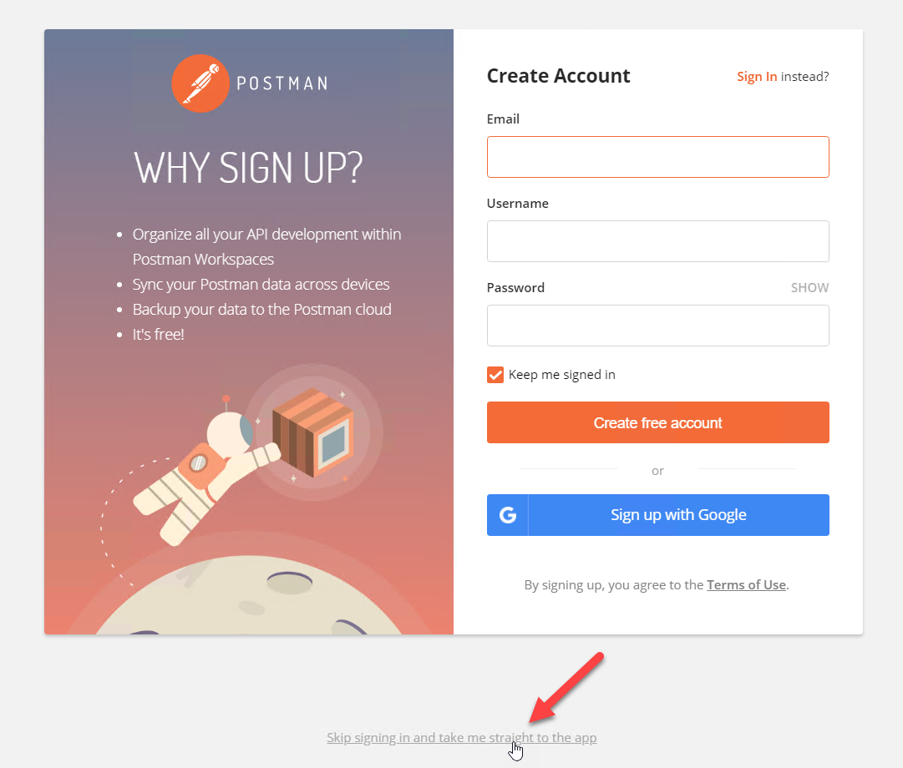

If you decide to use Postman extensively in the future, I recommend creating an
account so that your Postman Collections will be synchronized across devices.

## 2. Make a simple unauthenticated request

After the login screen, you will be shown the Create New screen. (If you do not see this screen, click the `+ New` button in the upper left corner of the page).  The first
thing we are going to do is make a simple request to SPP.

Click on the `Request` button under `BUILDING BLOCKS`.

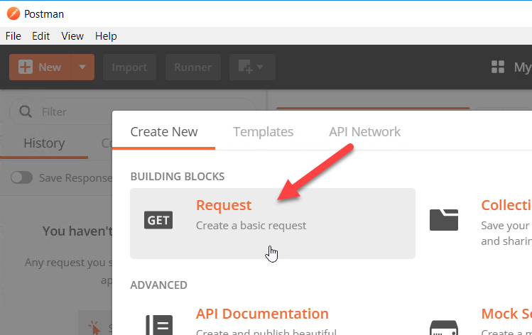

Give the new request this name: `GET Appliance Health`.

Give the new request this description: `Get Safeguard appliance health from appliance service`.

Scroll down, as needed, and click on the `+ Create Collection` link to create a new Postman Collection.

Call the new Postman Collection `Safeguard`.


Click the check mark to save the `Safeguard` collection.

Click on `Save to Safeguard` to finish creating your new request.

You will probably need to
disable SSL verification. If you do, go to the drop-down menu `File -> Settings` and turn off the
toggle next to `SSL certificate verification`.

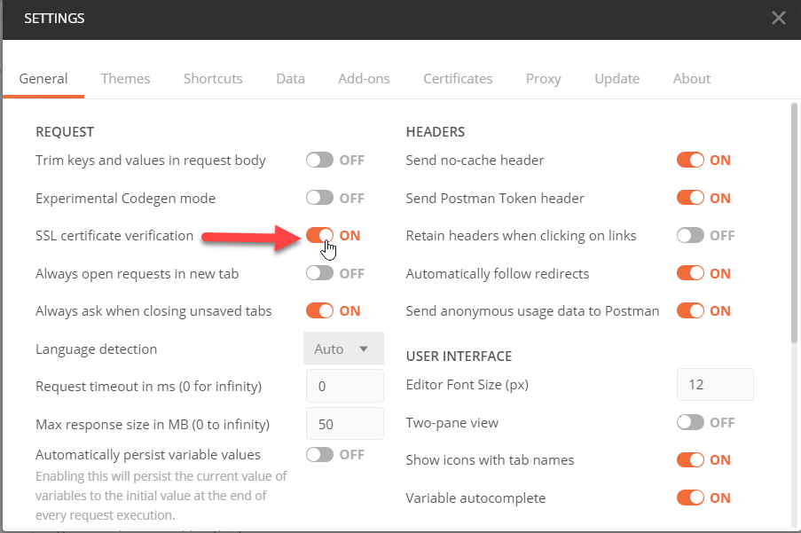

Then, you need to fill out the request with a URL: `https://<address>/service/appliance/v4/ApplianceStatus/Health`
but replacing `<address>` with your appliance network address or DNS name.

Then, go back and click on the `Send` button (see the following illustration).

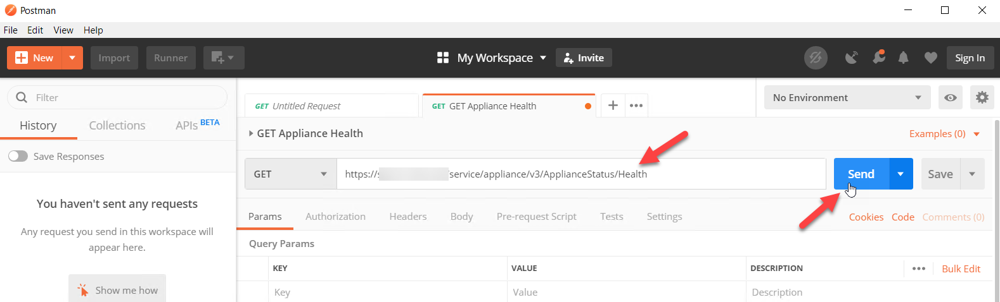

This should result in a successful query of the appliance health. You will notice that you get pretty-printed JSON, and you can collapse elements of
it for better visibility in analyzing the response.

## 3. Import directly from Safeguard OpenAPI file

Now is a good time to take a minute to understand the Postman interface and
Postman Collections a little better. In the Postman interface, open requests
show up in tabs across the top of the UI. You can edit and save open requests
back to your collection.

Click on the `Save` button drop down then `Save As`.  Click the `Save to Safeguard` button to save the `GET Appliance Health` request that you
created in the previous step.

In the pane on the left there are two tabbed views: `History` and
`Collections`. `History` shows any requests that you have run in you Postman
workspace. You can clear your `History` at any time, but you can also reload
a request from there into a new tab even after you have modified it in your
current tab.

Switching over to the `Collections` tab, you should be able to see the one
request that you have saved thus far.  Click the `Safeguard` collection to view `GET Appliance Health` inside the collection.

When looking at an individual request tab in the right pane, lower down on the form there is
an additional row of tabs that allow you to set different attributes of the
request. This is where you set parameters, fill in the request
body, or modify request headers.


With the method that we showed in step 2 of this lab, you must create each
individual request that you want to call. There is an easier way to
do this, but the easier method has its own drawbacks.

You can import all the requests from an entire service in one shot
by downloading the OpenAPI file and importing it into Postman.

First, you need to open a browser and navigate to the following for the OpenAPI data of a given service in the SPP API:

`https://<address>/service/<service>/swagger/v4/swagger.json`

Let's choose the `core` service,
because it is the biggest and has the most examples of different types of
SPP API endpoints.  Enter the following using your Safeguard network address:

`https://<address>/service/core/swagger/v4/swagger.json`

When the OpenAPI file is loaded in the browser as a giant document, you should
be able to right-click in Chrome then `Save as` or, in Firefox, you can click the
`Save` button in the upper left of the view.  Once you have the file saved as
`v4.json`. You will be able to import it into Postman.  Go back to Postman and click the `Import` button.

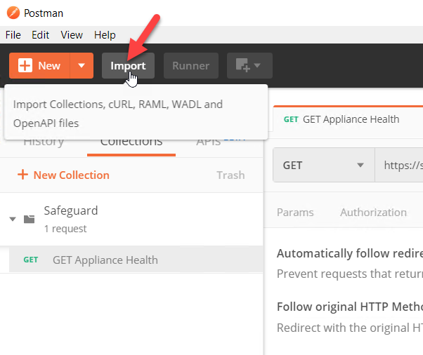

When the Import form pops up click on the `Choose Files` button.

Select the `v4.json` file that you downloaded.

If you see an `IMPORT` screen, select `Generate a Postman Collection`.

After you select the `v4.json` file, it doesn't seem like the dialog is responding, but then it will close and
send you back to the main Postman view. After a few seconds a pop up appears in the lower right corner saying that the file was imported.

If you go back to the `Collections` tab in the left pane and expand the `Safeguard Core API / v4`
node, you will see that the entire `core` service has been imported into
Postman.


Take a moment to browser through all the endpoints that have been loaded
into Postman. This is the entire content of what you saw in the Swagger UI.
There are a couple of issues with using these endpoints directly, but they can
serve as a very good starting point with a little modification.

Consider the issues below.  You do not need to perform these actions now.  Just become familiar with the issues and the location to change the settings.

- For some reason Postman imports these with all of the query parameters turned
  on and filled out with bogus sample values. You will need to turn these off
  by unchecking the boxes.  See the example that follows.
- The body is assumed to be application/x-www-form-urlencoded which means the
  `Content-type` header needs to be changed to application/json.
- On the body tab the attributes that need to be encoded as JSON are there, but
  in order to send them you need to switch to select the `raw` option and change the
  `Text` drop down to `JSON`. You will need to craft the JSON yourself.
- Most SPP API endpoints require authorization so you will need
  to learn how to create a SPP API token and save it in a variable. You
  will learn this later in this lab.

Once you have made changes to a request you can save it back to the imported
collection or you can use `Save as` to save it to a different collection. You
will do this later in this lab to add to the `Safeguard` collection we
created earlier.

Another thing you will notice about these imported requests is that the URL
does not contain an appliance IP address or DNS name. Instead it contains the
string `{{baseUrl}}` as shown below. This is a variable. 

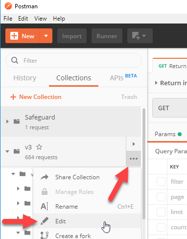

Using such a variable is a really
good idea because it allows you to switch the context of the entire collection
to call a different appliance just by changing one value.

To see the `baseUrl` variable, select your `v3` collection in the left pane and
click on the three dots `...`. Select the `Edit` option. On the next form click
on the `Variables` tab.

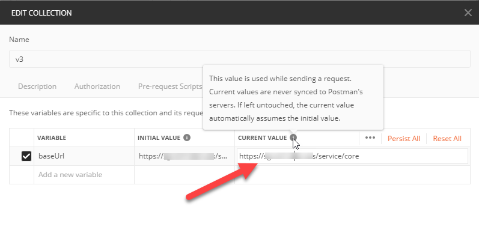

On this view, you can change the `CURRENT VALUE` of the variable which is what
will be sent to replace `{{baseUrl}}` in any of the requests in this
collection. You could actually modify `baseUrl` to include `{{server}}` which
would allow you to create another variable called `server` with just the IP
address or DNS name of the target appliance.

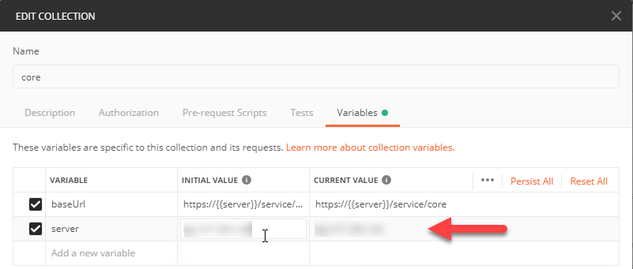

Before moving on in this tutorial, you can rename your collection. You can do
this on the `EDIT COLLECTION` view, or by selecting it in the left pane of the
main page, clicking on the three dots `...`, and selecting the `Rename` option.

## 4. Import a starter collection for authentication

In order to use the SPP API from Postman you need to be able to
authenticate. Authentication is a multi-step process with the SPP API, so
it isn't possible to do that by creating a single request. For
multiple requests to work together, they need to be part of a collection and
they need to be able to pass information to one another via the environment.

To set this up easily, you need to download and import these two files:
- [Authorize Collection](data/Authorize.postman_collection.json)
- [Safeguard Environment](data/Safeguard.postman_environment.json)

To download, click each of the links above, and then right-click the `Raw` button
and select `Save link as` to get the actual JSON file.

These files should be saved:
- Authorize.postman_collection.json 
- Safeguard.postman_environment.json 


First, upload the environment file.

Click the `Import` button in the main Postman interface.

Click the `Choose Files` button and select the
`Safeguard.postman_environment.json` file that you downloaded.

You will see a pop up in the bottom right corner that it was imported.

On the upper right side of the Postman interface, select the `No Environment`
drop down and change it to `Safeguard Environment`.

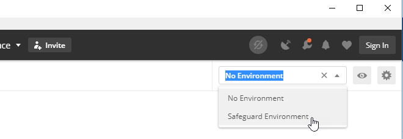

Then, click the eye ball icon next to the drop down and select the `Edit` link
to modify the environment values.

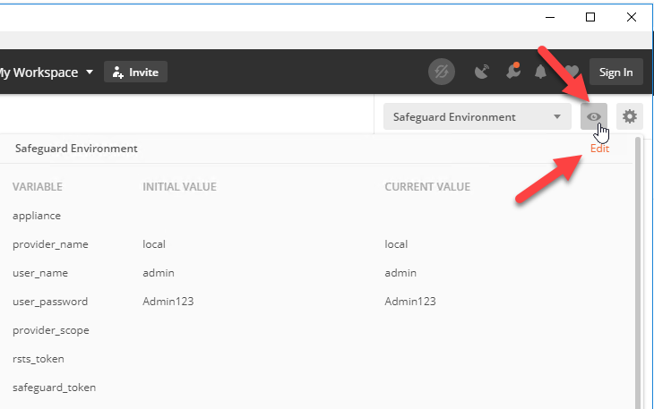

Scroll as needed to set the `CURRENT VALUE` for `appliance`, `user_name`, and
`user_password` to the correct values for your SPP.

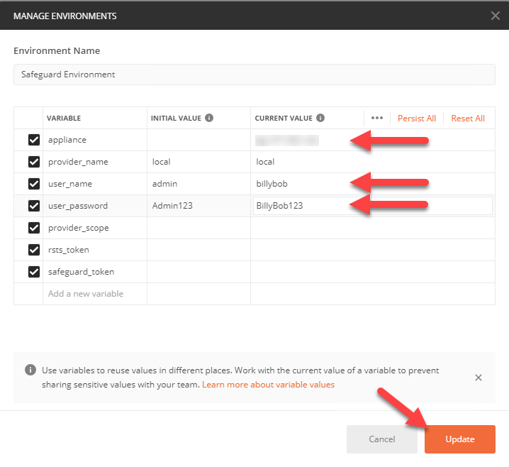

Click the `Update` button and then press the `X` on the `MANAGE ENVIRONMENTS`
dialog to close the dialog.

Now, import the collection file.

Click the `Import` button in the main Postman interface.

Click the `Choose Files` button and select the
`Authorize.postman_collection.json` file that you downloaded.

You will see a pop up in the bottom right corner that it was imported, and
you will notice a the `Authorize`collection in the left pane.

Click on the `Authorize` collection to show the three POST requests inside. In
order to authenticate you need to run all three of the requests in succession.
They will use the variables from the environment, `appliance`, `provider_name`,
`user_name`, and `user_password` to authenticate you. If you are using Active
Directory you can use the `provider_name` to make that work. For local accounts
you can just leave the value set to `local`.

As the collection runs, it will populate the other variables in the environment
with values. When the entire collection run is successful, you will have a
value for `safeguard_token`.

To run the collection click the `▶` play button next to the `Authorize` collection.

Then, click the `Run` button.

This will load the `Collection Runner` form.

Make sure that `Environment` is set to the `Safeguard Environment` environment is selected.

Make sure that the `Keep variable values` check box is checked. (See the illustration below).

Then, click the `Run Authorize` button.

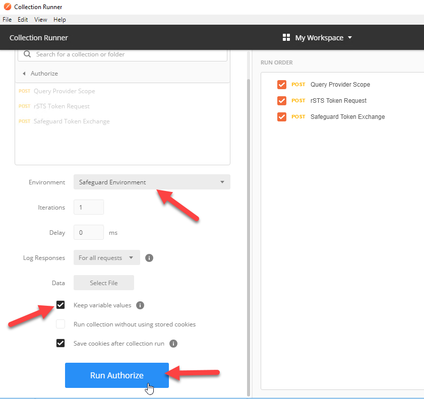

The `Run Results` tab in the dialog will show information for `PASSED` and `FAILED`.

Click the `X` to close the `Collection Runner` dialog.

Click on the eye ball icon next to the `Safeguard Environment` drop down.

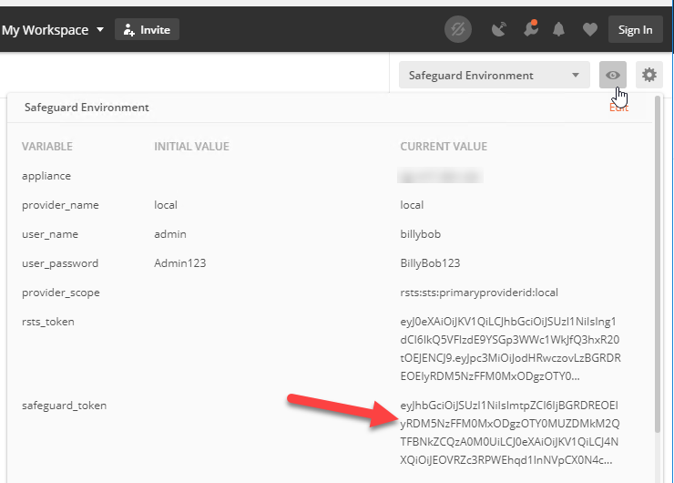

You should see a value for `safeguard_token`.

Take a minute to look at the `Authorize` collection. Click on the `...` button
and click `Edit`.  You will see that there are some collection variables set for
`rstsUrl` and `coreUrl` that are generated based on the value of `appliance`
from the environment.

If you look at the attibute tabs of the requests in the `Authorize` collection,
you will see examples of using variables in the `Body` and using `Tests` to set
values for variables in the environment.

Now that `safeguard_token` is set in the environment we can use it in other
collections.

To make this useful in your `Safeguard Core API` collection:
1. Edit the collection.
2. Click on the `Authorization` tab.
3. Set the type to `Bearer Token`.
4. Set the `Token` value to `{{safeguard_token}}`.
5. Click `Update`.

To use this in one of the requests under `core`:
1. Pick any GET request (v4/Me for example)
2. Uncheck all the query parameters on the `Params` tab
3. On the `Authorization` tab change the drop down to `Inherit auth from parent`
4. Click the `Send` button

Click the `Save` button to save the request when you are done.

PUT and POST requests are a little more difficult, because you have to build
the JSON body that will be sent in the request. Most of the properties listed
are not required. You can use Swagger UI or the information in the
`application/x-www-form-urlencoded` version to determine which properties to
send.

Each time you customize a request to make it work, be sure to save it for
future use.

You may want to turn on
`File -> Settings -> REQUEST, Always ask when closing unsaved tabs`.

Another thing you may want to do is go back into your `Safeguard Core API` collection and set
it up to use the `appliance` variable rather than the `server` collection
variable you created earlier.

## 5. Running a simple POST

First, let's use Postman to create a new asset partition in SPP. To do this
you need to go under your `Safeguard Core API` collection and click on `POST Adds a new AssetPartition`.

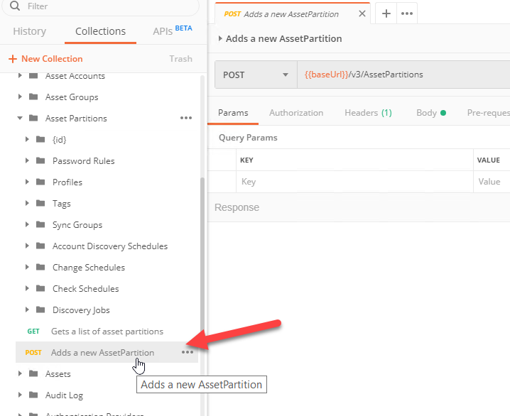

In the right pane, select the `Body` tab and select the `raw` option. Change the `Text` drop down to
`JSON`.

On the `Authorization` tab, make sure the `TYPE` is `Inherit auth from parent`.

On the `Headers` tab, make sure the `Content-Type` is `application/json`.

Click the `Body` tab and add the following body:

```JSON
{
	"Name": "<pick a name>",
	"Description": "Hands on lab partition"
}
```

But, replacing `<pick a name>` with a name for your partition.

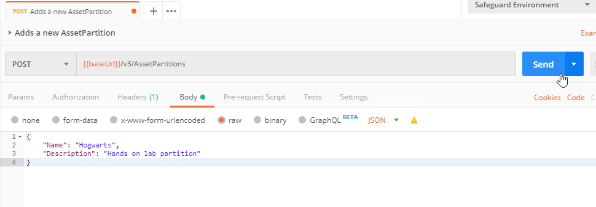

Take note of the "Id" that comes back in the response. You may need this value
in the future.

## 6. Building and running a saved collection

Some tasks in SPP take more than one request to the SPP API. Previously
in Swagger UI, we created a user. In this step, you will modify the `Safeguard`
collection to perform that task.

First, remove the `GET Appliance Health` request by clicking on the `...`
button next to the request and select `Delete` from the list.

Click the `Delete` button on the confirmation dialog.

Now, click the `...` button next to the `Safeguard` collection again and select
the `Edit` option.

Go to the `Variables` tab and add a variable called `coreUrl`.

Set its `INITIAL VALUE` to `https://{{appliance}}/service/core` and that will
propagate to the `CURRENT VALUE` as well.

On the `Authorization` tab set the `TYPE` to `Bearer Token` and set `Token` to
`{{safeguard_token}}`.

Click the `Update` button.

Rename the `Safeguard` collection to `New Local User` by clicking on the `...`
button next the collection and selecting `Rename`.

Click on the `...` button and select `Add Request`.

Call the new request `Create User Entity` and give it the description
`Create a new user object in SPP`.

Click the `Save to New Local User` button.

Open the new `Create User Entity` request and change it to a `POST` in the drop
down.

Set the URL to `{{coreUrl}}/v4/Users`.

The `Authorization` tab should already be set to `Inherit auth from parent`.

Make sure to change the `Content-Type` in `Headers` to `application/json`.

On the `Body` tab set the `raw` option and change the drop down from `Text` to `JSON`.

Add the following body:

```JSON
{
	"UserName": "<pick a name>",
	"FirstName": "<pick a name>",
	"LastName": "<pick a name>",
	"PrimaryAuthenticationProvider": {
            "Id": -1
        }
}
```

Replacing with a user name, first name, and last name of your choice.

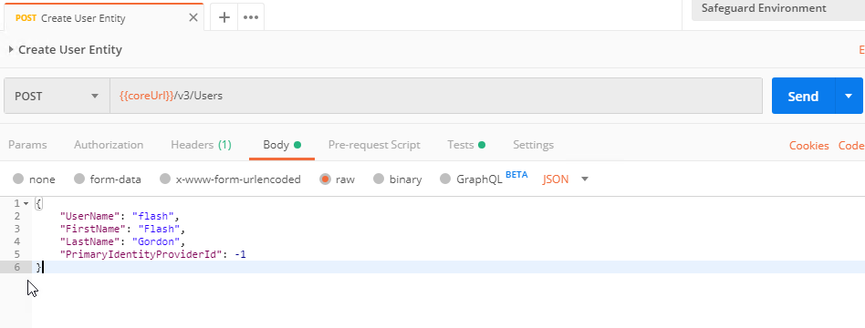

Click on the `Tests` tab and add the following:

```JavaScript
var jsonData = JSON.parse(responseBody);
pm.environment.set("new_user_id", jsonData.Id);
```

Click `Save` to save the request.

Now you will create another request for setting the password.

Click on the `...` button again and select `Add Request`.

Call the new request `Set User Password` and give it the description
`Set the password for the new user in SPP`.

Click the `Save to New Local User` button.

Open the new `Create User Entity` request and change it to a `PUT` in the drop
down.

Set the URL to `{{coreUrl}}/v4/Users/{{new_user_id}}/Password`.

The `Authorization` tab should already be set to `Inherit auth from parent`.

Make sure to change the `Content-Type` in `Headers` to `application/json`.

On the `Body` tab set it to `raw` and the drop down to `JSON`.

Add the following body:

```JSON
"<pick a password>"
```

Replacing with a password of your choice.

Click on the `Tests` tab and add the following:

```JavaScript
pm.environment.unset("new_user_id");
```


Click `Save` to save the request.

Now run the `New Local User` collection.


You will see that the first request returns 201 and the second request returns
204, and there isn't a `new_user_id` variable leaked into your environment.

If something has gone wrong you can click on the name of the request to see
exactly what was actually sent to the appliance, e.g. URL, headers, body, etc.

This script could be refactored to take the fields for the new user and the new
password from variables in the collection or you can modify the body each
time you run the collection.


NEXT: [SPP 4 -- Scripting with safeguard-ps](../spp4-safeguard-ps)
