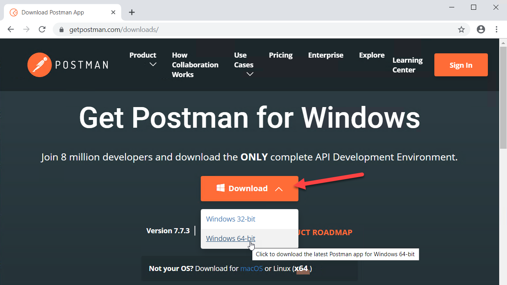

# Postman Hands-on Lab

## 1. Download and install Postman

First we need to download [Postman](https://www.getpostman.com/downloads/).

Click on the Download button from the menu and select 64-bit.

Run the installer after it downloads.

Postman should start automatically, but if it doesn't load it from the Windows
start menu or the desktop icon.

You will be presented with a sign-in form. You can choose to sign into Postman
either by creating an account or signing in with your Google account.

If you don't want log in or create an account, there is a link to skip login at
the bottom of the sign-in screen.

If you decide to use Postman extensively in the future, I recommend creating an
account so that your Postman Collections will be synchronized across devices.

## 2. Make a simple request to notification

After the login screen, you will be shown the Create New screen. The first
thing we are going to do is make a simple request to Safeguard.

Click on `Request` button under `BUILDING BLOCKS`.

Give the new request a name, `GET Appliance Health`.

Give the new request a description, `Get Safeguard appliance health from appliance service`.

Click on the `Create Collection` link to create a new Postman Collection.

Call the new Postman Collection `Safeguard`.

Click the check mark to save the `Safeguard` collection.

Click on `Save to Safeguard` to finish creating your new request.

Then, you need to fill out the request with a URL: `https://<address>/service/appliance/v3/ApplianceStatus/Health`
but replacing `<address>` with your appliance network address or DNS name.

Before you click the `Send` button to send the request, you probably need to
disable SSL verification. If you do, go to `File -> Settings` and turn off the
toggle next to `SSL certificate verification`.

Then, go back and click on the `Send` button.

This should result in a successful query of the appliance health. You will
will notice that you get pretty-printed JSON, and you can collapse elements of
it for better visibility in analyzing the response.

## 3. Import directly from Safeguard OpenAPI file

## 4. Import a starter collection for authentication

## 5. Building and running a saved query

## 6. Building and running a saved collection
