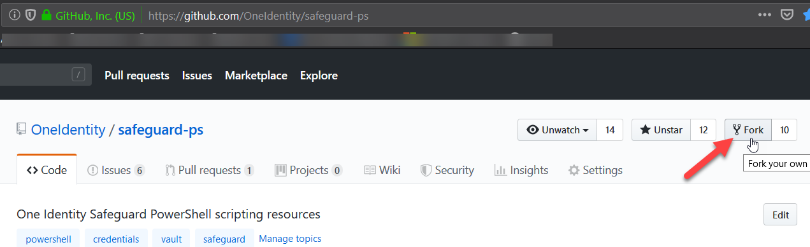
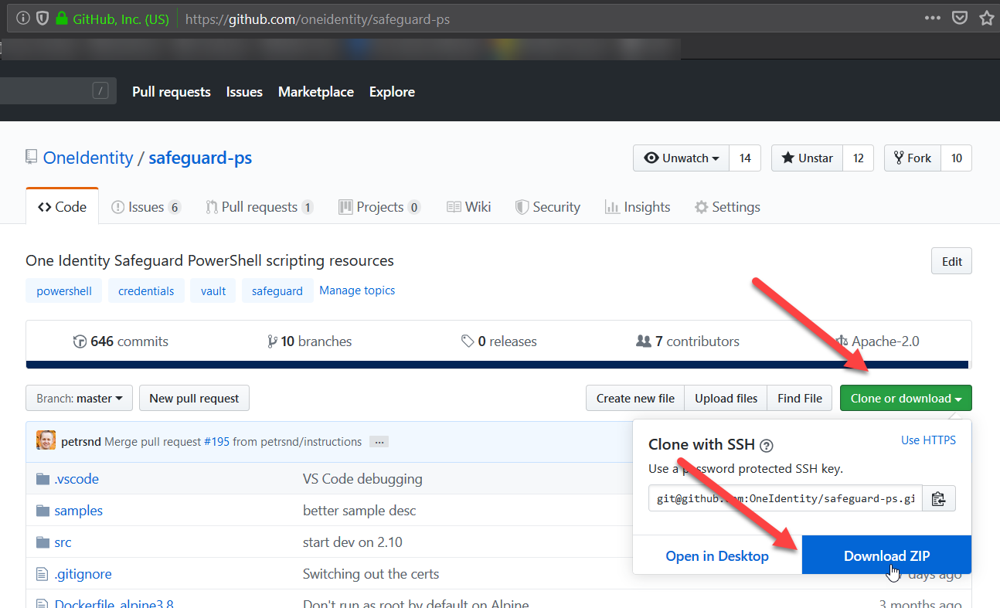
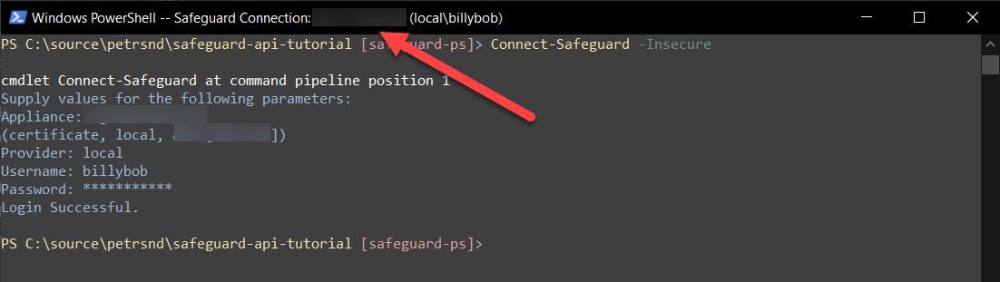

# safeguard-ps Hands-on Lab

The safeguard-ps cmdlets are much easier to use than Swagger UI or Postman. One
way in which they are easier is that in most cases, cmdlets will prompt you for
missing input rather than sending a partial request body to SPP. safeguard-ps
is meant to be an interactive command line interface to SPP as well as a
scripting language for automation. We will use it in both ways in this lab.

safeguard-ps has some core functionality that can be used to send any sort of
Safeguard API request, but it also has specific cmdlets for doing specific jobs
in SPP.

To start we will need to install safeguard-ps on your computer.

## 1. Install safeguard-ps from the PowerShell Gallery

safeguard-ps is hosted on the PowerShell Gallery.

Open a browser, navigate to `powershellgallery.com`, and search for
`safeguard-ps`.


To install it, open your start menu and right click on PowerShell to select the
`Run as Administrator` option.

Installing safeguard-ps is a one-liner from a PowerShell command prompt:

```PowerShell
PS> Install-Module safeguard-ps
```

By default, the `Install-Module` cmdlet will find safeguard-ps in the
[PowerShell Gallery](https://www.powershellgallery.com/) and install it for all
users. This means you need to be running PowerShell as an administrator who can
install software for all users.

The installation process will prompt you as to whether you want to trust the
PowerShell Gallery, because it is not trusted by default. `¯\_(ツ)_/¯`

If running as administrator is not an option, you can install safeguard-ps just
for the current user by opening a normal PowerShell prompt and typing:

```PowerShell
PS> Install-Module safeguard-ps -Scope CurrentUser
```

The `Install-Module` cmdlet will install the latest stable version of
safeguard-ps. There is always a version of safeguard-ps released with a version
matching the first two number of the SPP version it was built to work with.

For example: `SPP 2.9`.0.10658 goes with `safeguard-ps 2.9`.379

At the same time that safeguard-ps 2.9 is out safeguard-ps 2.10.xxx-pre is also
already available.

You can install the latest prerelease of safeguard-ps by typing:

```PowerShell
PS> Install-Module safeguard-ps -AllowPrerelease
```

If this doesn't work for you, then you probably have the crummy version of
PowerShellGet that comes with Windows and you should replace it with the newer
open source version.

You can do this by typing:

```PowerShell
PS> Install-PackageProvider -Name NuGet -Force
PS> Install-Module PowerShellGet -Force
```

To install a specific version of safeguard-ps you can use a command similar to:

```PowerShell
PS> Install-Module safeguard-ps -RequiredVersion 2.8.349
```

## 2. Check out safeguard-ps using git command line

*If you are not interested in using git or checking out the code you can skip
this section*

Anyone can check out the safeguard-ps code from the OneIdentity/safeguard-ps
GitHub repository.

Open a PowerShell prompt and go to a directory where you want the code to be
downloaded:

```PowerShell
PS> git clone git@github.com:OneIdentity/safeguard-ps.git
```

This will check out safeguard-ps using the SSH protocol. You can check it out
unauthenticated because it is open source.

If you want to actively participate in contributing the safeguard-ps project,
you will want to create a GitHub account (for free) and create your own fork
of the project.



Then, you can make changes in your own git branch and create a pull request
back to the OneIdentity/safeguard-ps repository. Forking, branching, and
creating a pull request is beyond the scope of this lab.

## 3. Install safeguard-ps from GitHub by downloading a zip

If for whatever version you cannot get the `Install-Module` method to work to
install safeguard-ps, you can always just download the source from GitHub.

Open a browser and go to: `github.com/oneidentity/safeguard-ps`



Click on the `Clone or download` button and click on the `Download ZIP`.

Save the zip file and unzip it wherever you wish.

Once it is unzipped you can go into the `safeguard-ps` folder and type:

```PowerShell
PS> ./install-local.ps1
```

This will install the latest source with a `.99999` final version number so
that it will be preferred over any other safeguard-ps module that might be
installed in another location.

## 4. Connecting to the Safeguard API

Once you have safeguard-ps installed, you can use the `Connect-Safeguard`
cmdlet to connect to SPP. Once connected you can call other cmdlets to interact
with SPP.

Let's start with an interactive connection that creates a safeguard-ps session.

First, run the following:

```PowerShell
PS> Connect-Safeguard -Insecure
```

The `-Insecure` parameter tell safeguard-ps to ignore SSL certificate
validation. You won't need that if you set up certificates correctly in SPP.

safeguard-ps will respond with a prompt:

```PowerShell

cmdlet Connect-Safeguard at command pipeline position 1
Supply values for the following parameters:
Appliance:
```

safeguard-ps needs to know which appliance you would like to connect to. Type
the DNS name or IP address of your appliance a press enter.

safeguard-ps will respond with another prompt:

```PowerShell
(certificate, local, ad4 [company.corp])
Provider:
```

SPP allows multiple identity and authentication providers for its users. By
default there is a `local` provider for users that are internal to SPP and a
`certificate` provider for users that authenticate with a client certificate.
Certificate users are often used in automation. The bootstrap admin (named
Admin) is an example of a user from the `local` provider.

The `ad4 [company.corp]` provider is an Active Directory domain called
company.corp that has been added to this SPP. You can select that provider by
typing either `ad4` or `company.corp`.

Type the name of your provider and press enter.

safeguard-ps will respond by prompting for a user name:

```PowerShell
Username:
```

Type the name of your user and press enter.

safeguard-ps will respond by prompting for a password:

```PowerShell
Password:
```

Type in your password and press enter.

Notice that this time your input was masked.

Safeguard will respond by saying your login was successful. The entire exchange
should look something like this:

```PowerShell
PS> Connect-Safeguard -Insecure

cmdlet Connect-Safeguard at command pipeline position 1
Supply values for the following parameters:
Appliance: <removed>
(certificate, local, ad4 [company.corp])
Provider: local
Username: billybob
Password: ***********
Login Successful.

```

At this point safeguard-ps has created a login session for you. This means that
you don't have to provide credentials when calling the other safeguard-ps
cmdlets. They are all executed in the context of this initial connection. If
you look at the top of your terminal window, you will see your connection
information.



Run the following command to reuse your session:

```PowerShell
PS> Get-SafeguardLoggedInUser
```

safeguard-ps will send an HTTP request to `GET service/core/v3/Me` but it will
automatically fill out the `Authorization` header for you.

You will notice the result to that cmdlet is not JSON. When making HTTP
requests from PowerShell, the results are automatically converted for you into
a PowerShell object. This makes it easy for you to use PowerShell scripting
constructs on the output of safeguard-ps cmdlets.

For example, run the same cmdlet again with this syntax:

```PowerShell
PS> (Get-SafeguardLoggedInUser).AdminRoles
```

Instead of getting the full output of the HTTP request, you will just get a
list of admin roles for the logged in user (hopefully you had some otherwise
that command line above will appear to do nothing).

You may have a situation where you want to call SPP, but you don't want to
create a session that persists between commands. You can do this by passing the
`-NoSessionVariable` parameter. This time we will also pass in several
parameters directly on the command line.

Type the following:

```PowerShell
PS> Connect-Safeguard -Insecure -Appliance <your server> -Provider local -Username <your username> -NoSessionVariable
```

You will see that SPP returns a giant string containing your Safeguard API
token. In order to make use of it you need to capture it in a variable.

Because safeguard-ps also supports positional parameters, you can type the
following shorter form of the command:

```PowerShell
PS> $tok = (Connect-Safeguard -Insecure <your server> local <your username> -NoSessionVariable)
```

Before using `$tok` variable, you should log out of your session so that you
can see that your specified token is being used rather than your session.

```PowerShell
PS> Disconnect-Safeguard
Logging out *********** (local\billybob)

Log out Successful.
Session variable removed.
```

The output will show you that it logged out the session. What that really means
is that that one token is logged out, but the token in `$tok` is still valid.

To use the `$tok` variable, type the following:

```PowerShell
PS> Get-SafeguardLoggedInUser -Appliance <your server> -AccessToken $tok -Insecure
```

You will notice that you have to specify the `-Appliance` parameter and the
`-Insecure` parameter when using the `-AccessToken` parameter to pass the
`$tok` variable. Normally those values are stored along with the Safeguard API
token in your session. safeguard-ps doesn't know what to use for those values
when you don't have a session. One way to recognize that you haven't created a
session yet is that you will try to run a cmdlet and will be prompted for an
appliance when you don't expect it.

You can invalidate the token stored in `$tok` by running the following:

```PowerShell
PS> Disconnect-Safeguard -Appliance <your server> -AccessToken $tok -Insecure

Log out Successful.
```

## 5. Finding a cmdlet and getting help to call it

Now that you know how to connect using safeguard-ps you need to know what
cmdlets you can call. safeguard-ps includes a cmdlet just for that purpose.

Run the following:

```PowerShell
PS> Get-SafeguardCommand
```

safeguard-ps currently includes 269 cmdlets, and the number is increasing all
the time. SPP contains approximately 800 Safeguard API endpoints, which means
there are specific endpoints that do not have safeguard-ps support.

With so many cmdlets it can be difficult to find the functionality you may be
looking for. The `Get-SafeguardCommand` cmdlet was built to accept up to three
positional parameters to refine exactly the cmdlet that you need.

One thing to know about PowerShell and cmdlets is that by convention they are
always singular, e.g. the cmdlet is called `Get-SafeguardUser`, not
`Get-SafeguardUsers`.

Assuming you want to find cmdlets that deal with creating access requests, run
the following:

```PowerShell
PS> Get-SafeguardCommand request
```

As you can see that returns a lot of results that may be difficult to look
through. Try running it with multiple search tearms:

```PowerShell
PS> Get-SafeguardCommand new request
```

You can see that the cmdlet you are looking for to create new access requests
is called `New-SafeguardAccessRequest`.

All of the cmdlets in the safeguard-ps module are of the form:

`<verb>-Safeguard<noun>`

Not ust any verb should be used in a cmdlet. Microsoft publishes a list of
verbs that are considered acceptable. See:
[Cmdlet Verbs](https://docs.microsoft.com/en-us/powershell/developer/cmdlet/approved-verbs-for-windows-powershell-commands)

When you find the cmdlet you want, it can be difficult to know exactly how to
call it. PowerShell has a built in cmdlet for determining usage.

Run the following:

```PowerShell
PS> Get-Help New-SafeguardAccessRequest -Full
```

Each safeguard-ps cmdlet includes usage information about each of the
parameters and a couple of examples.

PowerShell supports tab completion, which means you don't always have to type
the complete name of a cmdlet. Just type a portion of it and press the tab key,
and PowerShell will cycle through the known cmdlets that match what you typed.

## 6. Calling any endpoint using Invoke-SafeguardMethod

If you use `Get-SafeguardCommand` and cannot find a specific cmdlet for the
functionality that you are looking for, that doesn't mean you can't use
safeguard-ps for your project.

Every cmdlet in safeguard-ps is written in terms of a core safeguard-ps cmdlet
called `Invoke-SafeguardMethod`.

To see what it does run the following:

```PowerShell
PS> Get-Help Invoke-SafeguardMethod
```

Assuming you are using a session with `Connect-Safeguard`, the basic syntax for
calling `Invoke-SafeguardMethod` is:

`Invoke-SafeguardMethod` `<service>` `<http-method>` `<relative-url>`

So, an example could be:

`Invoke-SafeguardMethod core GET Users`

But, as you can see from the `Get-Help` output there are a lot of other
parameters available for customizing your request. The key parameters to know
about are:

| Parameter			| Description											| Parameter Value	|
| -----				| -----													| -----				|
| `-Accept`			| Specify what to pass for the HTTP Accept header		| application/json	|
| `-ContentType`	| Specify what to pass for the HTTP Content-Type header	| application/json	|
| `-Body`			| The body to pass in the request						| PowerShell object	|
| `-JsonBody`		| The body to pass in the request						| JSON string		|
| `-Parameters`		| The query parameters to pass in the request			| hash table		|
| `-OutFile`		| Store the response in a file							| path to file		|

The `-Parameters`, `-Body`, and `-JsonBody` parameters are the most useful. The
easiest way to learn to use these is to try out a few examples.

#### Specifying query parameters

Run the following to find a specific user by name:

```PowerShell
PS> Invoke-SafeguardMethod core GET Users -Parameters @{ filter = "UserName icontains 'billy'"; fields = "UserName,AdminRoles" }
```

Notice that semicolons (`;`) are used instead of commas to separate properties
in a hash table in PowerShell.

#### Specifying a body

The body can be built using a hash table, and it can actually be split across
lines.

Run the following to create a user:

```PowerShell
PS> Invoke-SafeguardMethod core POST Users -Body @{
    UserName = "NewGuy"
}
```

You will notice that the request fails. The error message says the request is
invalid, but you can't see exactly what is wrong. If you tack on the `-Verbose`
parameter you can see more of the response body that gives more information:

```PowerShell
PS> Invoke-SafeguardMethod core POST Users -Body @{
    UserName = "NewGuy"
} -Verbose
```

And, you will see the problem:

```
VERBOSE: {"Message":"The request is invalid.","ModelState":{"entity":["Required property 'PrimaryAuthenticationProviderId' not found in JSON. Path '', line 3, position
1."],"entity.PrimaryAuthenticationProviderId":["The field PrimaryAuthenticationProviderId must be a valid non-zero database ID."]},"Code":70000}
```

So, adding the authentication provider Id (-1 is the built-in local provider):

```PowerShell
PS> Invoke-SafeguardMethod core POST Users -Body @{
    UserName = "NewGuy";
    PrimaryAuthenticationProviderId = -1
}
```

#### Specifying a body as JSON

Specifying a body as JSON is important for two reasons: 1) you happen to have
the body already stored in a JSON string, and 2) it is actually difficult
sometimes to get PowerShell to create objects properly when using shortcuts of
hash tables to create them. In the latter case it can just be easier to throw
in a string.

The basic thing to know when dealing with JSON string bodies is that the
escape character for double quotes (") is the backtick character (`).

Type in the following:

```PowerShell
PS> Invoke-SafeguardMethod core POST Users -JsonBody "{
    `"UserName`":  `"AnotherNewGuy`",
    `"AdminRoles`": [`"UserAdmin`",`"AssetAdmin`",`"PolicyAdmin`"],
    `"PrimaryAuthenticationProviderId`": -1
}"
```

## 7. Creating assets and running management tasks

#### Background

The following step requires that you either have SPP 2.10+ or that you have a
real asset that you can place under management. You are going to create assets
and then run platform tasks such as check password and change password on those
assets. SPP 2.10+ includes a platform type called "Other Managed", which is a
variation on the "Other" platform that SPP has had for some time.

An "Other" asset is one that SPP will store the password for, but SPP does not
maintain an active connection or service account for managing those passwords
on the target system. This means the SPP will not check the password or change
the password of account on a system of type "Other". The password will just be
statically stored in SPP.

On an "Other Managed" asset, SPP will store the password and check and change
it periodically according to profile configuration. However, SPP still does
not have an active connection or service account, but it rotates the password
internally and sends event notifications when that is done. This can be useful
for a variety of application to application and DevOps scenarios as well as
custom platform scenarios involving one-way firewall rules.

#### Creating an asset and an account

If you don't have an asset partition created yet, you should create one using
a command similar to the following (you can name it whatever you like):

```PowerShell
PS> New-SafeguardAssetPartition Hogwarts
```

Then, create an asset of type "Other Managed" in that new asset partition
(again, name it whatever like):

```PowerShell
PS> New-SafeguardAsset -AssetPartition Hogwarts -Platform "Other Managed" Gryffindor
```

Then, you just need to create an account on the asset (use a different name if
you like):

```PowerShell
PS> New-SafeguardAssetAccount Gryffindor hpotter
```

Now you have an asset called `Gryffindor` in the asset partition `Hogwarts`
that has an account called `hpotter`, or you have the same entities but with
the different names you chose instead.

Run the following, supplying the names you used in the previous commands:

```PowerShell
PS> Get-SafeguardAssetAccount -Fields "AssetName,Name,HasPassword" Gryffindor hpotter

AssetName  Name    HasPassword
---------  ----    -----------
Gryffindor hpotter       False
```

#### Running a management task

As you can see SPP has the account, but it doesn't have a password. You can set
the password with the following cmdlet, but then you will know the password
because you are prompted for it:

```PowerShell
PS> Set-SafeguardAssetAccountPassword Gryffindor hpotter
NewPassword: **********************

```

However, you can force SPP to change the password immediately with the
following command:

```PowerShell
PS> Invoke-SafeguardAssetAccountPasswordChange Gryffindor hpotter
Task completed successfully.
```

Password changes and other management tasks can be long-running when they
involve network connections, so you will notice that a progress bar was shown
at the top of the terminal.

Now, if you run the following again:

```PowerShell
PS> Get-SafeguardAssetAccount -Fields "AssetName,Name,HasPassword" Gryffindor hpotter

AssetName  Name    HasPassword
---------  ----    -----------
Gryffindor hpotter       True
```

You can see that `hpotter` now has a password in SPP.

There a lot of other cmdlets that can be used to manage assets and accounts. In
order to see all of them run:

```PowerShell
PS> Get-SafeguardCommand Asset
```

To get information about an individual cmdlet, an example of what you can run
would be:

```PowerShell
> Get-Help New-SafeguardAssetAccountRandomPassword

NAME
    New-SafeguardAssetAccountRandomPassword

SYNOPSIS
    Generate an account password based on profile via the Web API.


SYNTAX
    New-SafeguardAssetAccountRandomPassword [-Appliance <String>] [-AccessToken <Object>] [-Insecure] [[-AssetToUse] <Object>] [-AccountToUse] <Object> [<CommonParameters>]


DESCRIPTION
    Generate an account password based on profile.  The password is not actually stored in
    Safeguard, but it could be stored using Set-SafeguardAssetAccountPassword.  This can
    be used to facilitate manual password management.


RELATED LINKS

REMARKS
    To see the examples, type: "get-help New-SafeguardAssetAccountRandomPassword -examples".
    For more information, type: "get-help New-SafeguardAssetAccountRandomPassword -detailed".
    For technical information, type: "get-help New-SafeguardAssetAccountRandomPassword -full".
```

As you can see, that cmdlet would have been helpful to get a generated password
to use with `Set-SafeguardAssetAccountPassword`.

## 8. Creating a policy using a script

Creating an entitlement and an access policy is a complex operation, and
safeguard-ps doesn't currently contain specific cmdlets for calling each of the
required endpoints yet. So, to execute this step you are going to create a
script by creating a file called `New-SafeguardTestPolicy.ps1` and pasting in
the following text:

```PowerShell
Param(
    [Parameter(Mandatory=$true)]
    [string]$PolicyName,
    [Parameter(Mandatory=$true)]
    [string]$AssetName,
    [Parameter(Mandatory=$true)]
    [string]$AccountName
)

$ErrorActionPreference = "Stop"

try { Get-SafeguardLoggedInUser | Out-Null} catch { Write-Error "You must be logged in using Connect-Safeguard." }

try {
    $script:Entitlement = (Get-SafeguardEntitlement $PolicyName)
}
catch {
    $script:Entitlement = (New-SafeguardEntitlement $PolicyName)
}
```

## 9. Checking out passwords and launching sessions


## 10. Getting a support bundle


## 11. Setting up certificates and calling A2A

