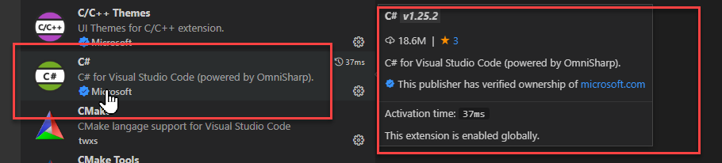
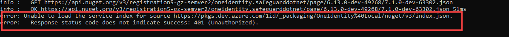
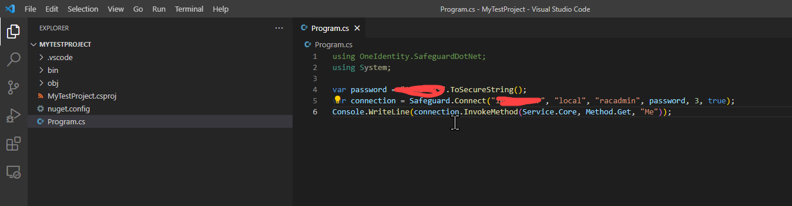

# SafeguardDotNet Hands-on Lab

SafeguardDotNet is a .NET library written in C#. It is available from NuGet.org
which makes it really easy to use C# to call the SPP API.

This lab will require Visual Studio Code which is a free code editor that
every developer or IT professional should use. It is extremely lightweight, and
it has broad support for many technologies, not just C# and .NET.

To download and install Visual Studio Code, visit the
[webpage](https://code.visualstudio.com/download) and follow the instructions.

And you'll need a C# extension:


## Creating a Visual Studio Code project

Once you have Visual Studio Code installed, it is very easy to create your
first project that calls the SPP API.

First, create a directory with the name you want to give your project and
change directory into it.

Run:
```PowerShell
PS> mkdir MyTestProject
PS> cd MyTestProject
```

Run:
```PowerShell
PS> dotnet new console
```

This will create a `console` project.  You can see other project types by
running `dotnet new`.

Run:
```PowerShell
PS> dotnet add package OneIdentity.SafeguardDotNet
```

This will add the latest OneIdentity.SafeguardDotNet NuGet package into your
project.

If you encounter the this error:


Add this file to your project: [nuget.config](data/nuget.config)

Run:
```PowerShell
PS> dotnet add package OneIdentity.SafeguardDotNet
```

Run:
```PowerShell
PS> dotnet restore
```

This will restore NuGet packages into your project so you can get code
completion in the editor

Finally, run:
```PowerShell
PS> code .
```

This will open the Visual Studio Code editor so you can begin adding code to
your project.

Add the using directive at the top of your `Program.cs` file to call
SafeguardDotNet:
```C#
using OneIdentity.SafeguardDotNet;
```

Find the line in the file that says `Console.WriteLine("Hello World!");` and
replace it with the following:
```C#
var password = "<your password>".ToSecureString();
var connection = Safeguard.Connect("<your server>", "local", "<your user>", password, 3, true);
Console.WriteLine(connection.InvokeMethod(Service.Core, Method.Get, "Me"));
```

You will need to replace the fields in angle brackets with the values for
authenticating one of your users.

Your source code editor should look similar to the following:


Go back to the command prompt and run the project by running the following:
```PowerShell
PS> dotnet run
```

In your terminal you will see JSON output describing the user that you
authenticated as.

This project is just a simple demonstration, but it could be expanded to do
whatever you want it to do.

SafeguardDotNet includes a number of key entry points:
- Use the `Safeguard` static class to contruct a `SafeguardConnection`
- Use the `Safeguard.Event` static class to construct a `PersistentSafeguardListener`
- Use the `Safeguard.A2A` static class to construct a `SafeguardA2AContext`
- Use the `Safeguard.A2A` static class to construct a `PersistentSafeguardA2AListener`

When using event listeners, you almost always want to use the persistent
versions, because they will reconnect if something goes wrong or if the access
token expires.

For more information, see the code in the sample projects 
[here](https://github.com/OneIdentity/SafeguardDotNet/tree/master/Samples).
